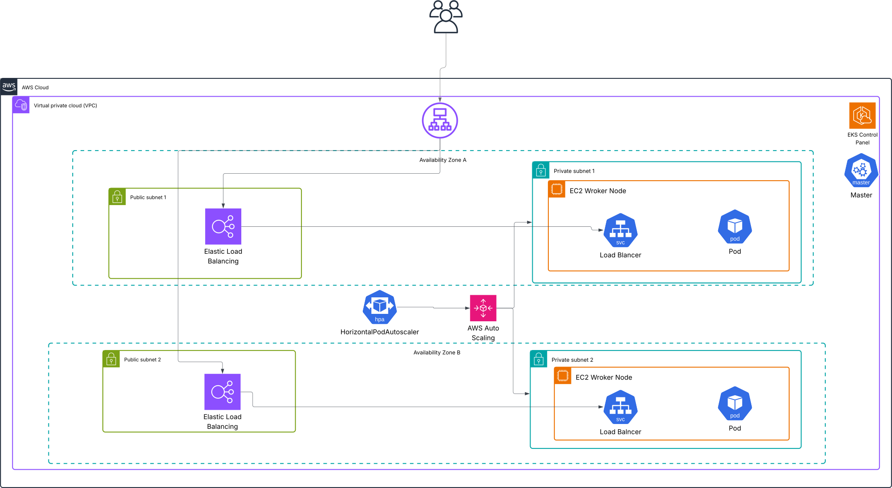

# Eyego DevOps Technical Task

This repository showcases a modern DevOps workflow for a **Node.js Express API**, deployed with **Docker**, **Kubernetes**, and a **Jenkins CI/CD pipeline**. While currently running on **AWS EKS** .

<p align="center">
  
</p>

## 🏗️ Architecture on AWS EKS

The production environment is built on AWS for high availability, security, and scalability.

* **Custom VPC**: The EKS cluster lives in a custom VPC spanning multiple availability zones, with two public and two private subnets to isolate resources.
* **Secure Node Placement**: Worker nodes (EC2 instances) run exclusively in **private subnets**, preventing direct internet exposure to the application workloads.
* **Managed Ingress**: Kubernetes services of type `LoadBalancer` automatically provision and configure AWS Load Balancers in the **public subnets** to securely expose the API endpoints.
* **Dynamic Autoscaling**: The setup uses the Kubernetes **Cluster Autoscaler** integrated with an AWS Auto Scaling Group (ASG). This automatically adjusts the number of worker nodes based on pod resource demands, optimizing for both cost and performance.

---

## DevOps Workflow

### 1. Containerization

- The application is packaged as a Docker container for consistency across environments.
- The `Dockerfile` defines the build process and exposes the required port for the Express API.

### 2. Kubernetes Deployment (EKS)
- Application deployment and service exposure are managed via Kubernetes manifests (`api.yaml`).
- Services of type `LoadBalancer` provide secure, external access to the API.
- Resource requests, limits, and readiness probes are configured for production-grade reliability.

### 3. CI/CD Pipeline (Jenkins)

- Jenkins automates the following steps:
  - Bumping the application version (`npm version patch`)
  - Building and pushing Docker images to AWS ECR
  - Deploying the latest image to EKS using `kubectl`
  - Committing version changes back to the repository
- All sensitive credentials (AWS, ECR) are securely managed in Jenkins.


---

## Accessing the API

You can access the deployed API using the following URL:

[ApiURL](http://a180860c9697045808b39ade36d3eabe-996605355.eu-north-1.elb.amazonaws.com/)

---

## Migration Steps: EKS to GCP (GKE)
### 1. Create a GKE Cluster

```sh
gcloud container clusters create eyego-cluster --zone <your-zone> --num-nodes=2
```

### 2. Authenticate kubectl with GKE

```sh
gcloud container clusters get-credentials eyego-cluster --zone <your-zone>
```
### 3. Push Docker Image to GCR/Artifact Registry

- Update your Jenkins pipeline to build and push to GCR:

gcloud auth configure-docker
```
docker tag eyegotask gcr.io/<your-gcp-project>/eyegotask:${IMAGE_TAG}
docker push gcr.io/<your-gcp-project>/eyegotask:${IMAGE_TAG}
```

### 4. Update Kubernetes Manifests
- Change the image reference in your `api.yaml` to use the GCR image


- GKE will automatically provision a Google Cloud Load Balancer for services of type `LoadBalancer`.

### 5. Apply Manifests to GKE

```sh
kubectl apply -f kubernetes/api.yaml
```

---

## References

- [Migrating from EKS to GKE](https://cloud.google.com/architecture/migrating-kubernetes-workloads-eks-gke)
